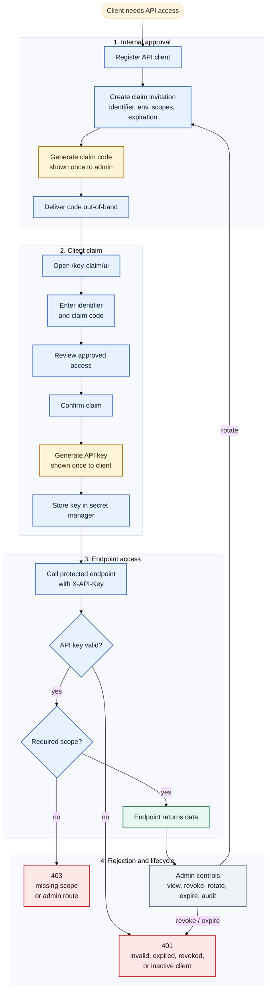

# API Key Client Claim And Endpoint Access Lifecycle

This graphic shows how a client gets the API key they will use to access protected FMT REST endpoints. It separates internal approval, one-time claim, runtime endpoint access, and lifecycle controls.

## Lifecycle Notes

- The raw claim code is shown once to the internal admin and is never stored, logged, or audited.
- The raw API key is generated only after successful claim completion and is shown once to the client-side admin.
- The client application uses the full API key in the `X-API-Key` header for normal endpoint access.
- API-key validation uses the stored key prefix for lookup and HMAC-SHA-256 for verification.
- Endpoint authorization uses scopes such as `read:aircraft`, `read:maintenance`, `read:pairs`, and `read:usage`.
- API keys never authorize admin routes; admin access remains separate from endpoint access.
- If the key is lost, revoked, expired, or rotated, the replacement path is a new claim invitation.
