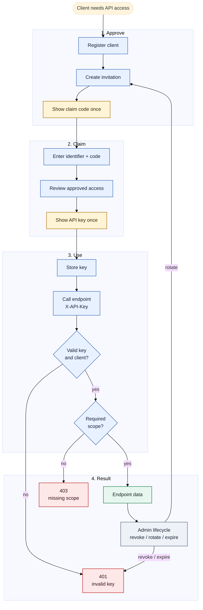

# API Key Client Claim And Endpoint Access Lifecycle V2

This version is a compact middle-ground diagram for workshop slides or handouts. It keeps the lifecycle readable without making the flow too wide or too tall.

## Reading The Diagram

- The admin approves access first; the client does not self-select scopes.
- The claim code and API key are both one-time display secrets.
- The client application uses the issued API key in `X-API-Key`.
- Runtime access has two checks: key validity first, then endpoint scope.
- Revocation, expiration, or rotation sends the client back through a replacement invitation path.
